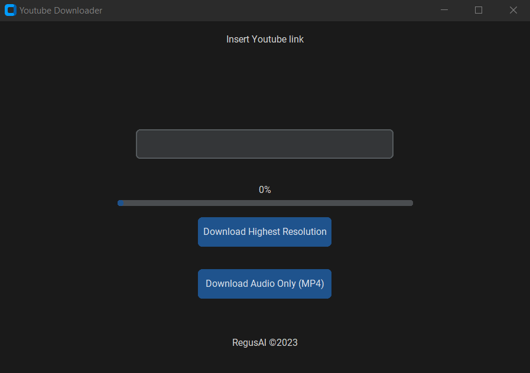
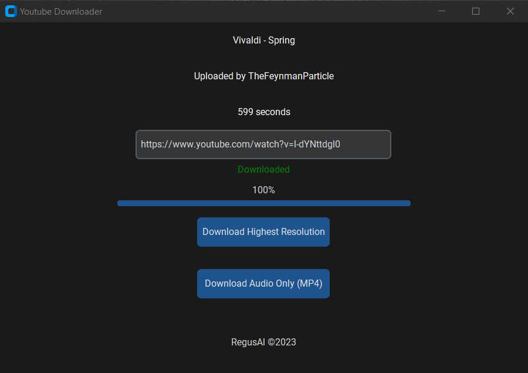

# YoutubeVideoDownloader

Cross-Platform app that downloads a youtube video based by the link inputted by the user. The user can download video (highest resolution) or audio (MP4)

Built with python and tkinter for GUI.

Works on Linux and Windows

## Demo

